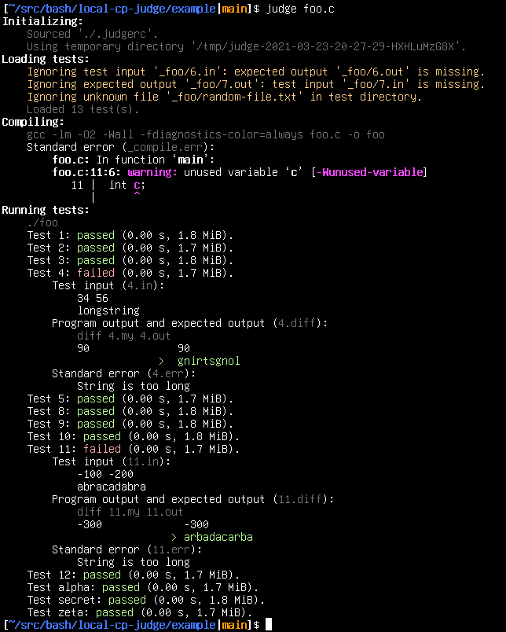

# local-cp-judge

`local-cp-judge` compiles source code and runs it on a set of test inputs. It reports whether each test matches the expected output, and also displays the execution time and memory usage. This is useful for competitive programming and quick testing of small programs.

## Installation

Download the [`judge`](judge) script, make it executable, and add it to a directory on your `$PATH`. Alternatively, run it with `bash judge`.

## Usage

See `judge --help`.

## Features

* Pipe test input to `judge` and get the test output on standard output
* Create test files interactively with the `-t` and `-T` options
* Customize compiler options, JVM options, etc. with a `.judgerc` file
* Examine compiler warnings, output file diffs, and other messages

## Limitations

* Execution time depends on a multitude of factors, including system load and CPU model.
* GNU `time` is required to show memory usage.
* Test cases with newlines (`\n`) in their _file names_ are not supported, because I decided that it wasn't worth making the code more complicated to support this edge case.

## Possible Improvements

* Warn about files that contain control characters or are missing a newline on the last line
* Add a command-line option to print the default `.judgerc`
* Allow short options to be combined
* Output a summary at the end
* Add a command-line option to hide the test data, showing results only
* Code cleanup
